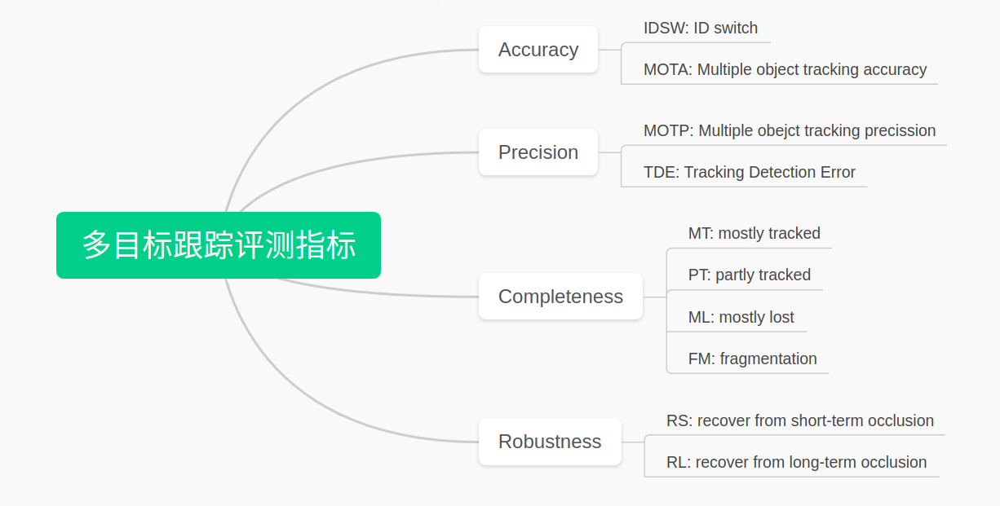
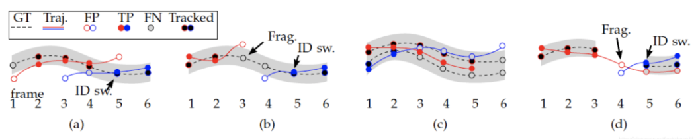
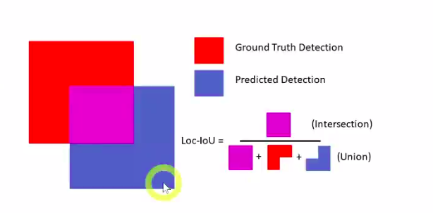
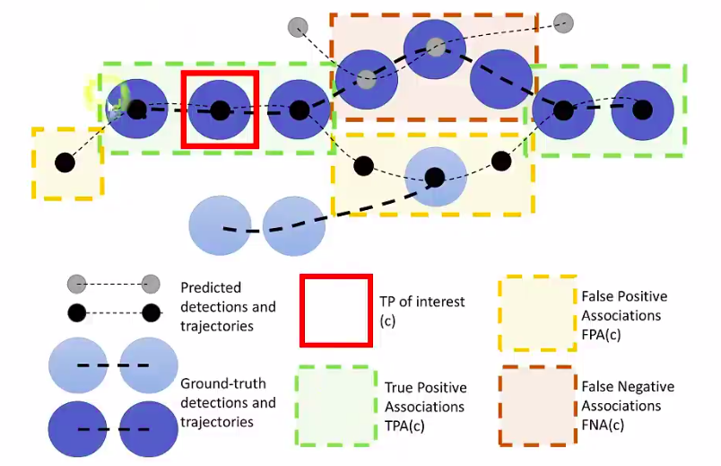
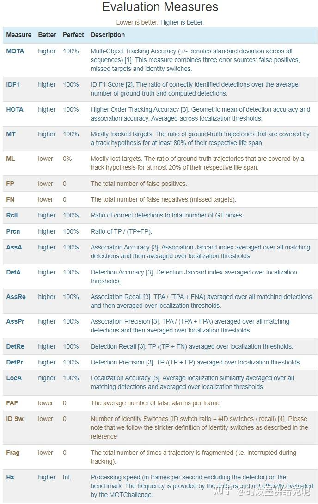

# 简介

# MOTA
multiple object tracking accuracy. 值越大越好，计算公式：
$$
MOTA = 1 - \frac{\sum_t(FN_t + FP_t + IDSW_t)}{\sum_t{GT_t}}
$$
__在论文中的定义不是这个__  
指标解释：  
$GT_t$ 第t帧中Ground Truth的个数  
$FN_t$ 第t帧中漏检的个数  
$FP_t$ 第t帧中虚检的个数   
$IDSW_t$ 第t帧中轨迹的id号发生转变的个数  

如上图a所示：
帧1：GT漏检，且DUT虚检，则FN=1, FP=1  
帧2：GT与DUT匹配上，TP=1  
帧3：GT一个，DUT2个，GT与DUT匹配一个，TP=1, FP=1  
帧4：同帧3，TP=1, FP=1  
帧5：GT一个，DUT2个，GT与DUT匹配一个，TP=1, FP=1, id跳转 IDSW=1  
帧6：GT一个，DUT一个，匹配一个, TP=1  
则 FP = 4, TP=5, FN=1, FP=4, IDSW=1
# MOTP
multiple object tracking precision
$$
MOTP = \frac{\sum_{t,i}d_{t,i}}{\sum_t{c_t}}
$$
$c_t$ 第t帧成功与GT匹配的检测框数目  
$d_{i, t}$ 匹配对之间的距离度量，如IOU则MOTP值越大于好，如欧氏距离或马氏距离MOTP值越小越好。 
# MT
mostly tracked，对于所有GT里面的轨迹，满足高于80%的成功匹配的占比。  
如MOTA中的截图所示：  
图a中，只有第一个时间点没有匹配上，则5/6=83.3%，则MT=100%.   
图b中，两条DUT的匹配都没有超过80%，则MT=0。  
图c中，共有两条GT，上面那条5/6，下面1/3，则MT=50%.   
图d中，MT=100%
# ML
mostly lost,满足小于20%的时间成功匹配轨迹占比，与MT相反，数字越小，跟踪效果越好。
# IDSW
ID switch，表示成功匹配后的的id切换次数，此数值越小越好。  
# IDF1
IDP: identification precision  
$$
IDP = \frac{IDTP}{IDTP+IDFP}
$$
IDR: identification recall
$$
IDR = \frac{IDTP}{IDTP+IDFN}
$$
$$
IDF_1 = \frac{2}{\frac{1}{IDP}+\frac{1}{IDR}} = \frac{2IDTP}{2IDTP+IDFP+IDFN}
$$

# HOTA
Higher order tracking accuracy: 同时考虑 Detection, association, localization的精度。
## 定位精度
定位精度根据计算得到的互相匹配的预测和真值结果的IOU进行计算
$$
LocaA = \frac{1}{|TP|}\sum_{c\in{TP}}Loc-IOU(c)
$$

## 检测精度
上述的定位度量指标测量的是单个预测和真值检测的检测框的边界的对齐程度，而Det-IOU指的是所有预测和真值检测的对齐程度。
$$
Det-IoU = \frac{|TP|}{|TP|+|FN|+|FP|}
$$
## 关联精度
对于所有匹配的预测和真值的检测匹配做一个平均
$$
AssA = \frac{1}{TP}\sum_{c\in{TP}}Ass-IOU(c) = \frac{1}{TP}\sum_{c\in{TP}}\frac{|TPA(c)|}{|TPA(c)|+|FNA(c)|+|FPA(c)|}
$$

## HOTA
$$
HATA_a = \sqrt{DetA_a * AssA_a} = \sqrt{\frac{\sum_{c\in{TP_a}}Ass-IoU_a(c)}{|TP_a| + |FN_a| + |FP_a}}
$$
$$
HOTA = \int_{0\le\alpha\le1}HOTA_a\approx\frac{1}{19}\sum_{\alpha=0.05, \alpha += 0.05}^{0.95}HOTA_a
$$
其中 DetA和Assa基于特定Loc-IoU的匈牙利算法定义，对于每一个预支，将最终得分计算为检测得分和关联得分的几何平均值，通过积分不同的 $\alpha$ 的阈值，将定位精度纳入最终得分。

# 补充
$$
Accuracy = \frac{TP+TN}{TP+TN+FP+FN}
$$
$$
Precision = \frac{TP}{TP+FP}
$$
$$
Recall = \frac{TP}{TP+FN}
$$

# 参考 
1. https://motchallenge.net/results/MOT17/?orderBy=MOTA&orderStyle=DESC  
2. https://blog.csdn.net/jackzhang11/article/details/110456883   
3. https://zhuanlan.zhihu.com/p/405983694  
4. https://zhuanlan.zhihu.com/p/35391826  
5. https://www.bilibili.com/video/BV1Xk4y1w7uN/?spm_id_from=333.337.search-card.all.click&vd_source=ad9d1f3f4d1796ba8ffe9801404bb102   

